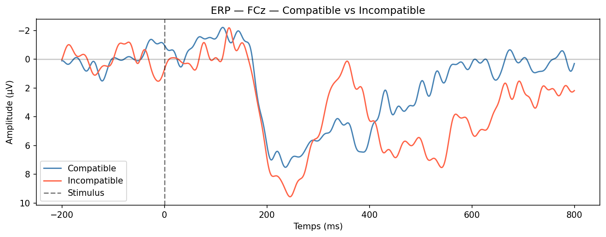
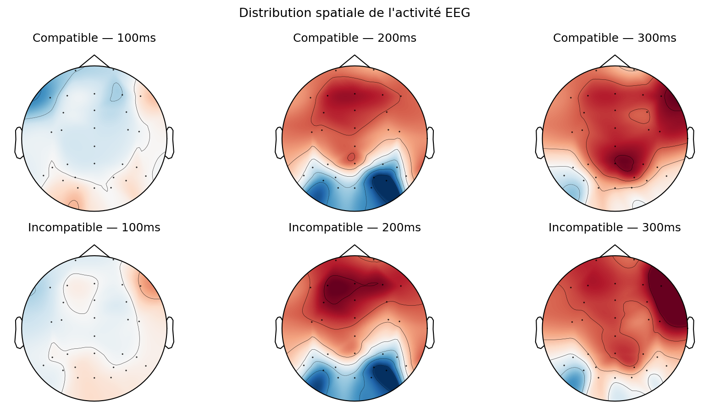

# Flankers ERP Analysis — MNE-Python

Replication of the Flankers congruence effect using EEG data 
from the ERP CORE dataset (Kappenman et al., 2021).

In the Flankers paradigm, participants respond to a central arrow 
flanked by compatible (→) or incompatible (→) distractors. 
Incompatible trials create response conflict, resulting in slower 
reaction times and a larger N2 component over frontocentral 
electrodes — a neural marker of conflict monitoring generated in 
the anterior cingulate cortex.

## Motivation

This project stems from a simple question : **how does one go from a raw noisy and uninterpretable EEG signal to a publishable ERP result ?**

This notebook is my attempt to walk through that process end-to-end, as a first step toward more advanced EEG analyses in the context of my master's application in cognitive neuroscience.

## Pipeline

1. Data loading (MNE-Python, ERP CORE dataset)
2. Band-pass filtering (0.1–40 Hz)
3. Epoching (−200ms → +800ms, stimulus-locked)
4. ERP computation — Compatible vs Incompatible
5. Topomap visualization
6. Statistical analysis (independent t-test, 150–300ms window)

## Key result

N2 amplitude was larger for incompatible trials (−9µV) than compatible trials (−7µV) at FCz, consistent with conflict monitoring literature. The effect did not reach significance in this single-subject analysis (t = −1.40, p = .163), which is expected given limited statistical power.

## Results

**ERP — FCz — Compatible vs Incompatible**

**Topomap — Distribution spatiale à 100, 200, 300ms**

## Dataset

ERP CORE — Kappenman et al. (2021). *NeuroImage*.  
Accessed via `mne.datasets.erp_core`

## Tools

Python · MNE-Python 1.12 · SciPy · Matplotlib
